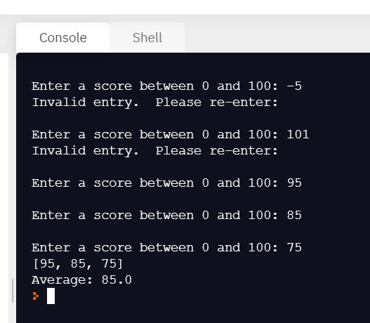

## Chapter 7 Practice - Files
### Notes:
- 🔥 **DO NOT make any changes to the `.devcontainer` folder or any files in it** 🔥  
- These are needed to set up your VS Code environment
---

### Instructions:
- Launch in Codespace
- Open the **`main.py`** file and follow along with the video:
> - **[YouTube Python Text Files](https://youtu.be/omb1UZTk1yw)** 
- Run your code to make sure it matches the sample output:  

---

### Committing and synching your changes:
- Commit changes as you go, even if you are not done, so that you don't lose your changes
- You must include a message with every commit
- When you are done with your code, your final commit message should say "Ready to grade"
---
### Submitting your assignment
- Open the assignment in Canvas
- Copy the URL for your repo and paste the link in the Canvas assignment as the answer to Question #1
- Answer the other questions
- On the last question, take a screenshot of your output and paste into the Canvas assignment
---

### Resources:
- **[W3Schools Python File Handling](https://www.w3schools.com/python/python_file_handling.asp)**
- **[W3Schools Python Read Files](https://www.w3schools.com/python/python_file_open.asp)**
- **[W3Schools Python Write/Create File](https://www.w3schools.com/python/python_file_write.asp)**
